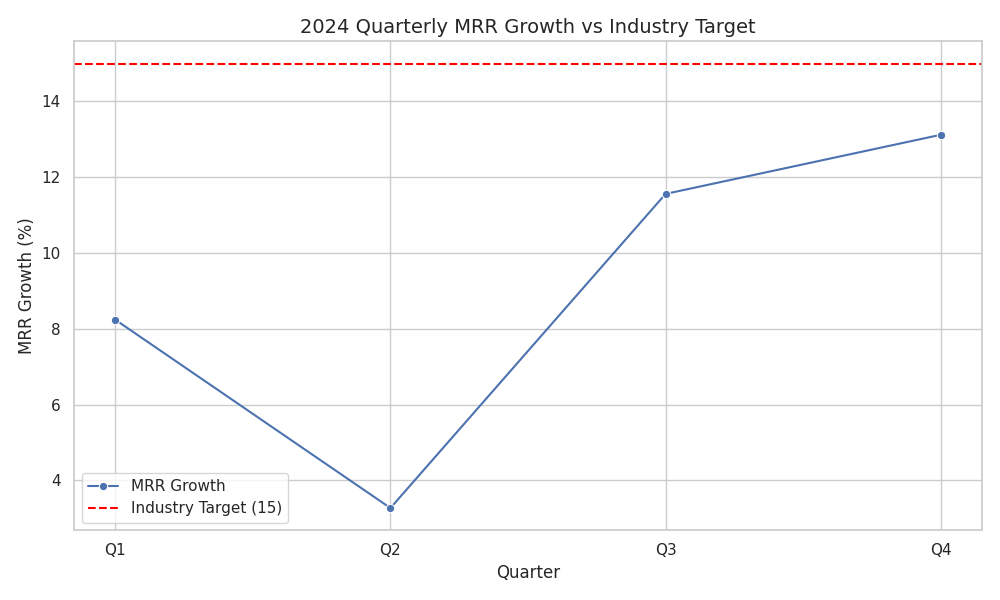

# SaaS Technology Performance Analysis

**Analyst Email:** 23f3004490@ds.study.iitm.ac.in

## Overview
The executive team requested an analysis of the company's quarterly MRR growth. The key objective is to understand the current growth trend and recommend strategies to reach the industry benchmark.

## Quarterly MRR Growth Data (2024)
| Quarter | MRR Growth (%) |
|---------|----------------|
| Q1      | 8.24           |
| Q2      | 3.27           |
| Q3      | 11.56          |
| Q4      | 13.12          |

**Average MRR Growth:** 9.05%  
**Industry Target:** 15%

## Key Findings
- The company’s average MRR growth (9.05%) is below the industry benchmark (15%).
- Q2 showed a significant dip, indicating potential seasonality or operational challenges.
- Growth trend is improving in Q3 and Q4, but still insufficient to meet the target.

## Business Implications
- Slower growth can limit resources for R&D, marketing, and expansion.
- Missing the industry benchmark may reduce investor confidence and market competitiveness.

## Recommendations
1. **Expand into new market segments**: Identify untapped customer segments or regions to drive higher MRR growth.
2. Invest in targeted marketing campaigns for low-performing quarters.
3. Enhance product features to increase upsell/cross-sell opportunities.
4. Implement continuous monitoring dashboards to track MRR trends in real-time.

## Visualization

